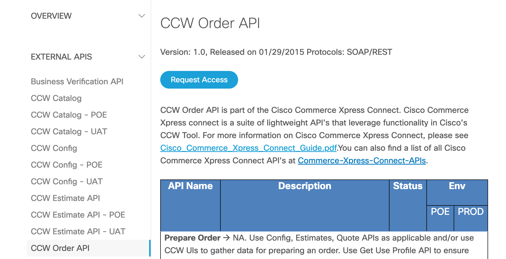
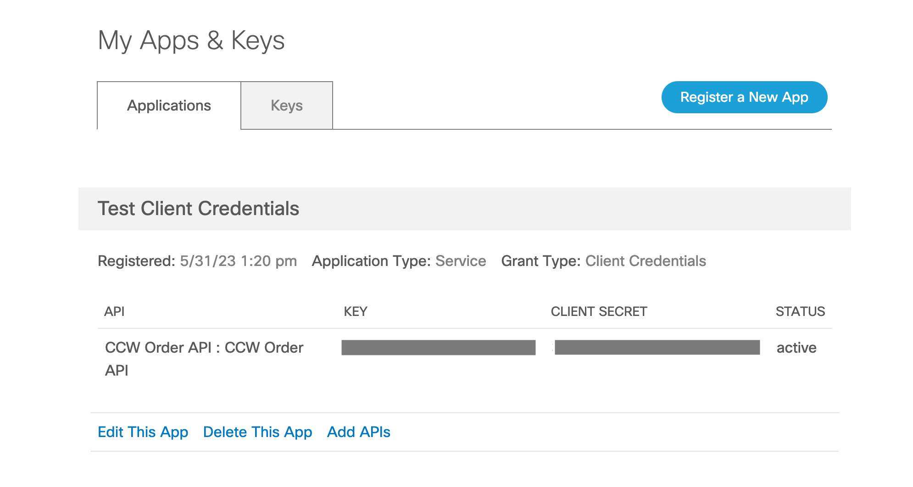
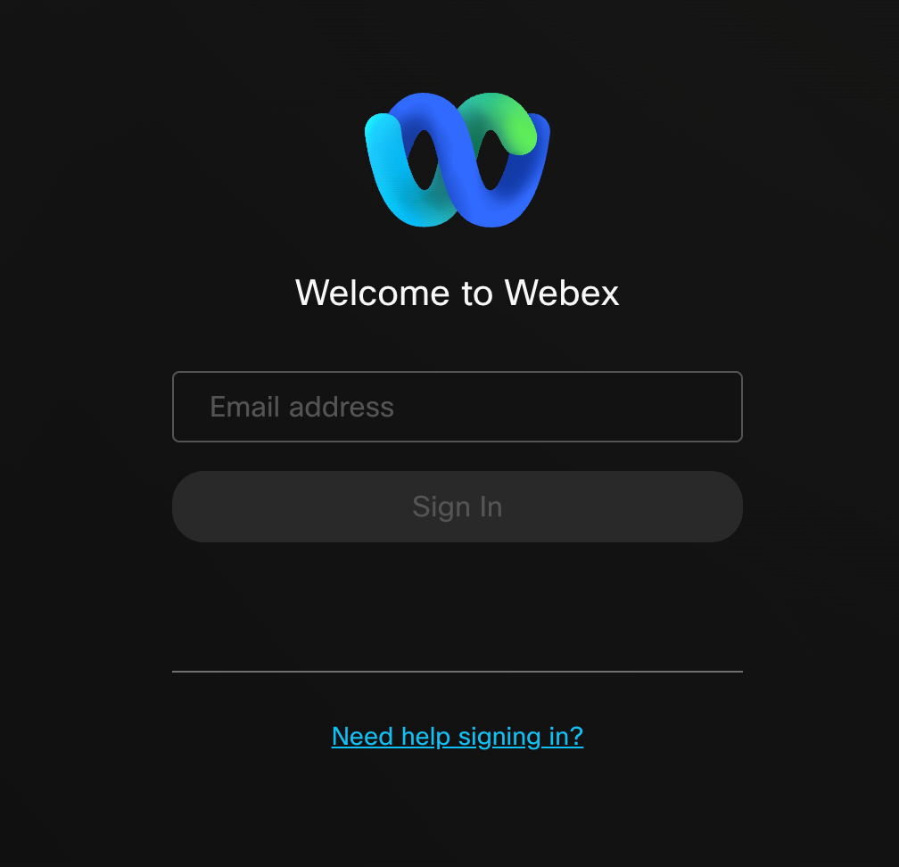
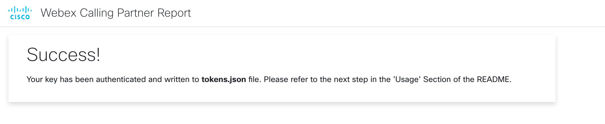
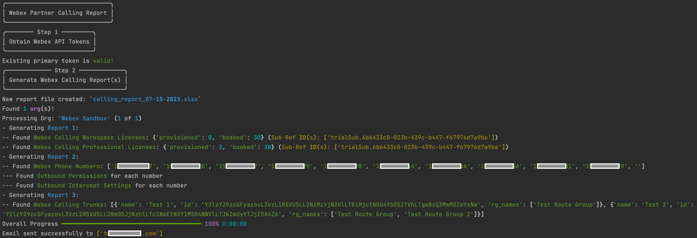
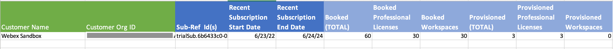
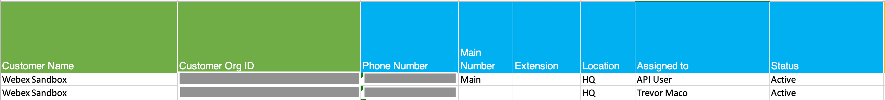
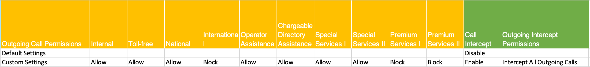
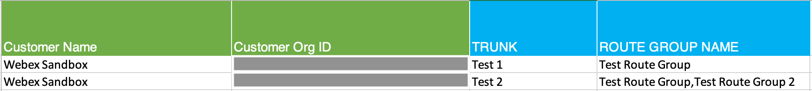
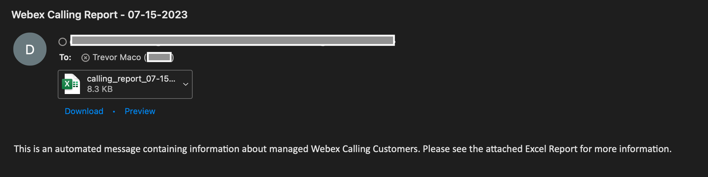

# Webex Calling Partner Report

This script generates Webex Calling reports for partners looking to gather insight on their customer deployments. 3 separate reports are generated, with the following focuses:
* License Usage and Assignment
* Provisioned Users
* SIP Trunks

## Contacts
* Trevor Maco
* Mark Orszycki

## Solution Components
* Webex Calling
* CCW API
* Email (Outlook, GMail)

## Prerequisites

### Webex OAuth Integration

**OAuth Integrations** are how you request permission to invoke the Webex REST API on behalf of another Webex Teams user. To do this in a secure way, the API supports the OAuth2 standard which allows third-party integrations to get a temporary access token for authenticating API calls instead of asking users for their password. 

**Note**: To generate a report for all managed customers, please use a `Partner Full Admin Account` throughout the process (recommended). An `Admin Account` with a subset of assigned customers will only generate a report for those customers.
**An admin account is essential to give full read access to customer orgs!**

To register an integration with Webex Teams:
1. Log in to `developer.webex.com`
2. Click on your avatar at the top of the page and then select `My Webex Apps`
3. Click `Create a New App`
4. Click `Create an Integration` to start the wizard
5. Follow the instructions of the wizard and provide your integration's name, description, and logo
6. Add the Following Redirect URI: `http://0.0.0.0:5500/callback` (**this must be exact**)
7. Add The following scopes to the application:
   * `spark-admin:organizations_read`
   * `spark-admin:telephony_config_read`
   * `spark-admin:licenses_read`
   * `spark-admin:people_read`
8. After successful registration, you'll be taken to a different screen containing your integration's newly created Client ID and Client Secret
9. Copy the secret and store it safely. Please note that the Client Secret will only be shown once for security purposes

> To read more about Webex Integrations & Authorization and to find information about the different scopes, you can find information [here](https://developer.webex.com/docs/integrations)

### CCW Order API

(**optional**) This application leverages the `CCW Order API` provided at https://apiconsole.cisco.com/ and the creation of an `App` to provide additional information around Webex Subscriptions in CCW. This integration is optional.

A detailed guide is included [here](https://apiconsole.cisco.com/docs/read/overview/Platform_Introduction), with summarized steps bellow:

1. Sign in to API Console with CCO Credentials
2. Request Access to the CCW Order API. This may take some time and involve a meeting and/or email exchange with the API team.



3. Register an `App` of `Application Type` "Service" and `Grant Type`  = "Client Credentials". Select the 'CCW Order API' (**note: if not present, then access has NOT been granted yet**)
    * Note the `key` and `secret`, which are required for authentication!



**Note**: this process may change in the future, always refer to the latest documentation on the platform.

### Email

(**optional**) This Application can send the generated report to 1 or more email addresses. To send an email programmatically, a source email user must be configured correctly. Refer to the following guide depending on provider (only Outlook and GMail currently supported):

   * Gmail: 
     * Requires an 'app password' and some setup. Refer to this [guide](https://support.google.com/accounts/answer/185833?visit_id=638001725430109553-3882188526&p=InvalidSecondFactor&rd=1)
       * Once configured, note the email username and app password

   * Outlook:
     * Refer to this [guide](https://learn.microsoft.com/en-us/exchange/clients-and-mobile-in-exchange-online/authenticated-client-smtp-submission) to ensure the mailbox is configured correctly.
     * Once Authenticated SMTP is enabled:
       * If 2-factor is **NOT** configured, note the email username and password
       * If 2-factor **is** configured: Refer to this [guide](https://support.microsoft.com/en-us/account-billing/manage-app-passwords-for-two-step-verification-d6dc8c6d-4bf7-4851-ad95-6d07799387e9#:~:text=Sign%20in%20to%20your%20work%20or%20school%20account%2C%20go%20to,page%2C%20and%20then%20select%20Done). Note the email username and app password

## Installation/Configuration
1. Clone this repository with `git clone [repository name]`
2. Add the Webex App Key and App Secret to `config.py` from the prerequisites section. Add the Name of the Webex Partner Org as well - found in the Account Tab (**this prevents processing of the partner org itself in the API calls**)
```python
WEBEX_CLIENT_ID = ""
WEBEX_CLIENT_SECRET = ""
PARTNER_ORG_NAME = ""
```
3. If you'd like to leverage the email capability, ensure `CCW_INTEGRATION` is set to True. Add the CCW App Key and App Secret to `config.py` from the prerequisites section (if relevant).
```python
CCW_INTEGRATION = False
CCW_CLIENT_ID = ""
CCW_CLIENT_SECRET = ""
```
4. Enter a file path where the report file should be saved. If left blank, the report file will be saved to the default `./reports/{report_name}` path in the current directory. Select the format of the report file (CSV or Excel). The default format is an Excel File with 3 sheets, but a zip of 3 CSV files is also supported.
```python
DESTINATION_PATH = ""
CSV_FORMAT = False
```
5. If you'd like to leverage the email capability, ensure `SEND_EMAIL` is set to True. Add the Email Username and Password  `config.py` from the prerequisites section for the relevant Email provider (if enabled).
```python
SEND_EMAIL = False

# Outlook/GMail:
EMAIL_USERNAME = ""
EMAIL_PASSWORD = ""
```
6. Add the list of 1 or more Email Recipients to `config.py` from the prerequisites section (if relevant).
```python
RECIPIENTS = ['example@email.com']
```
7. Set up a Python virtual environment. Make sure Python 3 is installed in your environment, and if not, you may download Python [here](https://www.python.org/downloads/). Once Python 3 is installed in your environment, you can activate the virtual environment with the instructions found [here](https://docs.python.org/3/tutorial/venv.html).
8. Install the requirements with `pip3 install -r requirements.txt`

## Usage
To generate a report, there are 2 important scripts: `app.py` and `report.py`.

* `app.py`: This web app script is required to generate the Webex OAuth Tokens, and **must be run first**. Run the script with:
``` bash
$ python3 app.py
```

Once the script is running, navigate to `http://0.0.0.0:5500` (the same one configured in the Webex Integration). This will prompt a Webex Login page.



Sign in with the `Partner Full Admin/Admin Account`. The account provided here grants the access permissions of the account to the token (in addition to the scopes defined in the integration).

You may be prompted to grant access to the integration. Once successful, a landing page with a 'Success' message is displayed:



An 'Access Token' and a 'Refresh Token' will be written to `tokens.json`. The 'Access Token' and 'Refresh Token' are valid for **14** and **90** days respectively. If the access token expires, it will automatically be refreshed if the refresh token is valid (and the refresh token's life is reset back to 90 days).

This process must only be completed once if the `report.py` script is run within 90 days of generating the tokens. Otherwise, if both tokens are expired, the process must be repeated.

* `report.py`: This script is the main report script. It relies on the tokens generated from `app.py`. Run the script with:
``` bash
$ python3 report.py
```

The script will generate the report (using the `calling_report_template.xlsx` as the template). The report will be named: `calling_report_{current date}.xlsx`. Console output and an example report are shown below:

* Console Output



* Sample Report 1



* Sample Report 2




* Sample Report 3



**Note**: If the CCW Integration is not enabled (or set up incorrectly), the `Start` and `End Subscription` date columns will be **empty**.

If the email functionality is enabled, all recipients will receive a copy of the report. The email will look like:



Any report errors encountered (ex: 403 API Response) are written to a date-stamped log file in the `logs` folder. Please consult the relevant log if data is missing from the report.

**Optional**: A cronjob (Linux) can be created to periodically run `report.py`. Please consult `crontab.txt` for more information.

**Optional**: A Windows Task can be scheduled to periodically run `report.py`. Please consult `windows_task.txt` for more information.


### LICENSE

Provided under Cisco Sample Code License, for details see [LICENSE](LICENSE.md)

### CODE_OF_CONDUCT

Our code of conduct is available [here](CODE_OF_CONDUCT.md)

### CONTRIBUTING

See our contributing guidelines [here](CONTRIBUTING.md)

#### DISCLAIMER:
<b>Please note:</b> This script is meant for demo purposes only. All tools/ scripts in this repo are released for use "AS IS" without any warranties of any kind, including, but not limited to their installation, use, or performance. Any use of these scripts and tools is at your own risk. There is no guarantee that they have been through thorough testing in a comparable environment and we are not responsible for any damage or data loss incurred with their use.
You are responsible for reviewing and testing any scripts you run thoroughly before use in any non-testing environment.